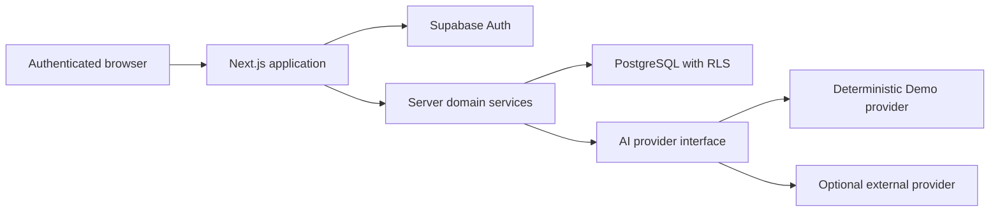

# CoopPilot Architecture

## 1. Purpose and scope

This document defines the proposed production architecture for the CoopPilot MVP. It is based on the complete CoopPilot product requirements supplied with the project. At the time this document was written, `docs/requirements.md` was not present in the workspace, so the supplied PRD is the requirements baseline.

The architecture covers only the MVP: a single-user-per-account job application tracker with profile management, job extraction, match analysis, cover letters, interview preparation, Kanban tracking, analytics, and a clearly labelled AI Demo Mode. Features explicitly listed as out of scope—such as automatic job submission, email/calendar integrations, browser extensions, payments, teams, and resume PDF editing—are not included.

## 2. Architectural goals

1. Keep every user's data isolated at both the database and application layers.
2. Preserve data across refreshes, sessions, and deployments.
3. Keep the entire core workflow usable without an external AI API key.
4. Make AI output reviewable, editable, validated, and traceable to user-provided facts.
5. Support desktop, tablet, and mobile without making drag-and-drop mandatory.
6. Prefer managed platform services for authentication, PostgreSQL, and deployment.
7. Deliver each product phase as an independently testable vertical slice.

## 3. Recommended stack

| Concern                | Choice                                                          | Reason                                                                                   |
| ---------------------- | --------------------------------------------------------------- | ---------------------------------------------------------------------------------------- |
| Web application        | Next.js App Router with TypeScript                              | One project for server-rendered UI, protected routes, server actions, and HTTP endpoints |
| Styling                | Tailwind CSS plus accessible headless components                | Consistent responsive UI without committing to a large visual framework                  |
| Validation             | Zod schemas shared by forms and server handlers                 | Identical client feedback and authoritative server validation                            |
| Forms                  | React Hook Form                                                 | Good support for large, dynamic profile and job forms                                    |
| Authentication         | Supabase Auth, email and password                               | Managed sessions and password handling with a PostgreSQL-compatible identity             |
| Database               | Supabase PostgreSQL                                             | Relational integrity, transactions, indexes, migrations, and Row Level Security          |
| Data access            | Server-side repository/service modules over the Supabase client | Centralizes ownership checks and keeps database calls out of UI components               |
| Drag and drop          | An accessible drag-and-drop library selected during Phase 4     | Keyboard support and reliable rollback are required                                      |
| Charts                 | A lightweight accessible chart library selected during Phase 6  | Charts must render real data and usable text alternatives                                |
| Unit/integration tests | Vitest and Testing Library                                      | Fast validation of rules, services, and components                                       |
| End-to-end tests       | Playwright                                                      | Verifies authentication and the complete user workflow                                   |
| Hosting                | Vercel for the web app, Supabase for Auth/PostgreSQL            | Straightforward managed deployment with server-only environment variables                |

Exact dependency versions will be locked when Phase 1 begins. No framework or package has been initialized yet.

## 4. System boundaries



### Browser responsibilities

- Render pages and accessible interaction states.
- Perform immediate form validation for usability.
- Submit mutations with idempotency keys where duplicate submission is risky.
- Optimistically update Kanban state and roll back on failure.
- Never receive an AI API key, database service-role key, or another user's data.

### Server responsibilities

- Resolve the authenticated user from the server session.
- Validate every input again with a Zod schema.
- Enforce application-level ownership before reads and mutations.
- Run AI requests and validate their structured responses.
- Compute dashboard statistics from persisted data.
- Return ordinary user-facing errors rather than stack traces.

### Database responsibilities

- Enforce foreign keys, checks, uniqueness, and valid status values.
- Apply Row Level Security to every user-owned table.
- Preserve status history and generated-document versions.
- Update timestamps and execute multi-record writes transactionally.

## 5. Application organization

The implementation should use domain-oriented modules rather than organizing all code by technical type.

```text
app/
  (public)/
  (auth)/
  (protected)/
  api/
features/
  auth/
  profile/
  applications/
  ai/
  analytics/
components/
  ui/
lib/
  auth/
  database/
  validation/
  errors/
```

UI components do not query tables directly. Page loaders and mutations call domain services, which call repositories. AI providers sit behind one interface and are not referenced directly by page components.

## 6. Page and route structure

### Public routes

| Route     | Purpose              |
| --------- | -------------------- |
| `/`       | Landing page         |
| `/signup` | Account registration |
| `/login`  | Email/password login |

### Protected routes

| Route                     | Purpose                                                       |
| ------------------------- | ------------------------------------------------------------- |
| `/onboarding`             | First profile setup                                           |
| `/dashboard`              | Summary metrics, deadlines, recent activity, and actions      |
| `/applications/board`     | Seven-column Kanban board                                     |
| `/applications`           | Searchable, filterable applications table                     |
| `/applications/new`       | Job description analysis, review, and manual entry            |
| `/applications/[id]`      | Complete job detail workspace                                 |
| `/applications/[id]/edit` | Job field editing                                             |
| `/profile`                | Profile, education, skills, experience, projects, preferences |
| `/analytics`              | Detailed application analytics                                |
| `/archive`                | Archived applications and restore action                      |
| `/settings`               | Theme, account identity display, and sign out                 |

Route middleware may provide an early redirect, but protected pages and mutations must also verify the server session. Middleware alone is not an authorization boundary.

## 7. Authentication and authorization

- Supabase Auth owns email, password hashes, and session lifecycle.
- The Auth email is canonical; the profile displays it rather than maintaining a second mutable copy.
- A profile row is created for each authenticated user.
- Every domain table stores `user_id`, even when ownership could be inferred through a parent. This makes RLS policies simple and auditable.
- RLS permits a user to select, insert, update, or delete only rows whose `user_id` equals `auth.uid()`.
- Server services still filter by the current user ID and return Not Found for resources not owned by that user.
- Demo account creation is performed by a server-side seed script. Administrative credentials are never shipped to the browser.

Password reset, social login, MFA, enterprise SSO, and organization accounts are not part of this MVP.

## 8. AI service abstraction

```ts
interface AIProvider {
  extractJob(input: JobExtractionInput): Promise<JobExtractionResult>;
  analyzeMatch(input: MatchInput): Promise<MatchAnalysisResult>;
  generateCoverLetter(input: CoverLetterInput): Promise<CoverLetterResult>;
  generateInterviewPrep(input: InterviewPrepInput): Promise<InterviewPrepResult>;
}
```

The interface is an architectural contract, not application code. The provider is selected on the server:

- If external AI configuration is valid, use the external provider.
- If the key is absent, use `DemoAIProvider` automatically.
- The response includes `mode: "external" | "demo"`, which is persisted and displayed.
- The browser cannot choose an unconfigured provider or provide a secret key.

### Structured output rules

- Every operation has an explicit schema.
- Unknown extracted values remain `null`, `Unknown`, or empty arrays.
- Dates are normalized only when the source provides a date.
- Skills are deduplicated without inventing related skills.
- Malformed provider output is rejected before persistence.
- AI errors do not block manual job creation or editing.

### Demo Mode

- Job extraction returns a fixed, reasonable structured example while preserving the submitted URL and complete original description.
- Match analysis is deterministic and uses only profile/job facts supplied by the user.
- Cover letters use a deterministic template and only real profile facts. Insufficient profile data produces a prompt to complete the profile rather than invented experience.
- Interview preparation is generated deterministically from stored job skills and user experience.
- Every result visibly displays `Demo AI Response`.
- Identical input produces identical output, which makes the mode testable.

### AI safety and versioning

- Match results include evidence references to the stored profile or job fields.
- Scores include the required five-part breakdown rather than only an overall number.
- Generated cover letters are versioned. Regeneration never destroys a prior version.
- A user-edited document is not overwritten silently.
- Interview preparation provides outlines, not fabricated complete personal answers.
- AI run records carry an idempotency key and status to prevent duplicate work.

## 9. Data flow for core workflows

### Add job

1. User submits a non-empty description and optional URL for analysis.
2. Server validates input and calls the selected AI provider.
3. Provider output is schema-validated and returned as an editable draft.
4. User corrects any field and submits the reviewed form with a creation key.
5. Server transaction creates the application, skills, and initial status event.
6. User is redirected to the new job detail page.

Analysis does not create an application, so retrying analysis cannot create duplicates.

### Change application status

1. The UI moves the card optimistically or submits a mobile status selector.
2. The server verifies ownership and the allowed status.
3. A transaction updates the current status and appends a status event.
4. On failure, the UI restores the previous status and displays an error.

### Generate content

1. Server loads the user's profile and application under the current user ID.
2. It rejects insufficient source data where required.
3. It creates or reuses an idempotent AI run.
4. It validates the result and saves a new analysis/document version.
5. UI displays the generation mode and generated time.

## 10. Error handling and consistency

- Use a small application error taxonomy: validation, unauthenticated, unauthorized/not found, conflict, AI unavailable, database unavailable, and unexpected.
- Errors returned to the browser contain a safe message and correlation ID, never a stack trace.
- Forms associate validation errors with their fields.
- Loading controls disable duplicate submission.
- Multi-table writes use transactions.
- Notes use debounced autosave with `Saving`, `Saved`, and `Could not save` indicators.
- Other forms use explicit Save actions with dirty-state protection.
- Kanban mutations use optimistic state only when a previous state is available for rollback.

## 11. Responsive design and accessibility

- The sidebar collapses into a labelled mobile navigation control.
- Tables use responsive cards or intentional horizontal scrolling.
- Kanban cards include a status selector on mobile, so drag-and-drop is optional.
- All inputs have programmatic labels and associated error text.
- Main actions are keyboard reachable and show visible focus.
- Status always has text or an icon in addition to color.
- Charts include titles, values, and text summaries.
- Confirmation dialogs trap focus and return it to the invoking control.
- Light and dark themes share readable contrast and consistent semantic colors.

## 12. Deployment and configuration

Expected server-side configuration:

- Supabase project URL and public anon key.
- Supabase server credentials required only by controlled migration/seed tooling.
- Optional external AI key and model configuration.
- Explicit AI mode override for tests.
- Application base URL.

Vercel hosts the Next.js application. Supabase hosts Auth and PostgreSQL. Schema changes are migration-driven; production is never modified manually as part of normal deployment. Preview deployments must not share production seed credentials.

### 12.1 Deployment strategy

The MVP ships as one full-stack Next.js application. Vercel hosts both the frontend and the server-side API routes/actions; Supabase provides Auth, PostgreSQL, and Row Level Security. No separate backend server or container is required. Supabase Storage is not part of the MVP because no file upload or attachment feature is in scope.

#### Production deployment flow

1. Push changes to the `main` branch of the GitHub repository (the source repository for the project).
2. Vercel builds the Next.js application automatically for the production environment.
3. The production build runs type checking, linting, and tests as part of the build/CI gate.
4. Database changes are applied separately before or as part of the deploy, in order:
   1. Run the migration on the production Supabase project.
   2. Run the production seed script only when a seed change ships (for example, the Demo account).
5. Vercel promotes the build to the production deployment.
6. The deployment verification checklist in 12.5 is run against the public URL.

Every environment (local, preview, production) gets its own Supabase project or at least its own database; preview deployments must never point at production data or seed credentials.

#### Required environment variables (production)

Server-side (never exposed to the browser):

| Variable                    | Purpose                                                                                                                                     |
| --------------------------- | ------------------------------------------------------------------------------------------------------------------------------------------- |
| `SUPABASE_SERVICE_ROLE_KEY` | Server-only credential used by controlled migration/seed tooling and any server-side administrative operation. Never shipped to the client. |
| `AI_API_KEY`                | Optional external AI provider key. When absent, `DemoAIProvider` is used automatically.                                                     |
| `AI_MODEL`                  | Optional model identifier for the external AI provider.                                                                                     |
| `APP_BASE_URL`              | Canonical public base URL of the application (for example, `https://cooppilot.vercel.app`).                                                 |

Client-safe (publicly readable by the browser; required for Supabase Auth/data access):

| Variable                        | Purpose                                                   |
| ------------------------------- | --------------------------------------------------------- |
| `NEXT_PUBLIC_SUPABASE_URL`      | Supabase project URL.                                     |
| `NEXT_PUBLIC_SUPABASE_ANON_KEY` | Supabase public anon key. Safe for the browser by design. |

#### Local development environment variables

- A local `.env.local` file contains the same variables as production, pointing at a local or personal Supabase project: `NEXT_PUBLIC_SUPABASE_URL`, `NEXT_PUBLIC_SUPABASE_ANON_KEY`, `SUPABASE_SERVICE_ROLE_KEY`, and optionally `AI_API_KEY`/`AI_MODEL`.
- `APP_BASE_URL` defaults to the local dev server URL (`http://localhost:3000`) when unset.
- `AI_MODE` may be set to `demo` for tests that must pin the provider; it is a test/development override only and is not a user-facing toggle.
- `.env.example` is committed with variable names and example placeholders only; `.env.local` and any real secret files are never committed.

#### Database migration procedure

- All schema changes are SQL migrations committed to the repository under the Supabase migrations directory.
- A developer writes the migration, reviews it locally, and runs it against the local database first.
- Integration/RLS tests run against the migrated schema before the migration is considered complete.
- Production applies migrations in order via the Supabase migration tooling (`supabase db push` or the equivalent managed flow). Migrations are applied before the application build that depends on them is promoted.
- The production database is never edited manually as part of normal deployment. The seed script is the only sanctioned way to create the Demo account and demo records, and it never receives credentials from the browser.
- Rollback is a new corrective migration, never a manual edit or destructive reset of the production database.

#### Deployment verification checklist

- The production URL loads over HTTPS.
- Missing or invalid required environment variables fail fast with a clear configuration error rather than a runtime stack trace.
- Sign-up, login, session persistence across refresh, and logout work against the production Supabase project.
- Protected routes redirect unauthenticated visitors to Login.
- The Demo Mode workflow completes for all four AI operations with no `AI_API_KEY` configured, and results are labelled `Demo AI Response`.
- A job created in production persists after refresh and re-login.
- Two-user isolation holds in production (spot-check or rely on the automated RLS/application-layer tests run before deploy).
- No secret appears in the browser bundle, network responses, or repository; the public anon key is the only Supabase credential in the client.
- The production smoke test record from Phase 7 is updated with the run results.

## 13. Testing strategy

- Unit tests cover validation, score calculations, analytics formulas, date warnings, and Demo Mode determinism.
- Repository integration tests verify ownership filters and transactions.
- RLS tests use two users and prove cross-user reads and writes fail.
- Component tests cover forms, dialogs, loading, error, and empty states.
- Playwright verifies registration/login, onboarding, adding a job, editing it, changing status, generating Demo content, and logging back in.
- Production smoke tests verify the same core path without mutating another user's data.

## 14. Known decisions and constraints

- Application deadlines are stored as calendar dates, not timestamps, because the PRD does not define a deadline timezone.
- Status history is mandatory because interview and offer rates depend on whether an application ever reached those stages.
- Profile email comes from Auth to avoid conflicting copies.
- Rich text is not needed for the MVP; user content is stored and rendered as plain text to reduce script-injection risk.
- Settings remains intentionally small and functional rather than becoming an unspecified account-management product.
- Public deployment depends on access to Vercel and Supabase projects during Phase 7.
