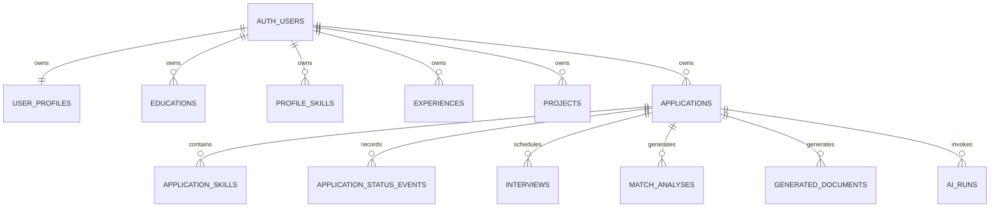

# CoopPilot Database Schema

## 1. Conventions

This is the logical schema for a Supabase PostgreSQL implementation. It intentionally describes tables, constraints, indexes, and policies without creating migrations yet.

- Primary keys are UUIDs.
- Timestamps use `timestamptz` and default to the database clock.
- Application deadlines use `date` because the source usually supplies a date without a timezone.
- Every user-owned table has a non-null `user_id` referencing `auth.users(id)`.
- Every user-owned table has Row Level Security enabled.
- Mutable records have `created_at` and `updated_at`; a database trigger maintains `updated_at`.
- User-entered prose is stored as plain text, not trusted HTML.
- Skill matching uses a normalized lowercase key while preserving the original display name.

## 2. Enumerated values

These may be PostgreSQL enums or check constraints. Check constraints are preferable if migrations need to evolve them safely.

### Application status

- `saved`
- `preparing`
- `applied`
- `interview`
- `offer`
- `rejected`
- `withdrawn`

### Skill requirement type

- `required`
- `preferred`

### Generated document type

- `cover_letter`
- `behavioural_questions`
- `technical_questions`
- `research_checklist`

### Generation mode

- `demo`
- `external`

### AI operation

- `job_extraction`
- `match_analysis`
- `cover_letter`
- `interview_prep`

### AI run status

- `pending`
- `running`
- `succeeded`
- `failed`

Other fields such as work arrangement, employment type, remote preference, and interview type remain constrained text rather than hard enums. Job postings often contain legitimate values outside a short fixed list, and the PRD only fixes application statuses.

## 3. Identity and profile tables

### `auth.users`

Managed by Supabase Auth.

Relevant fields:

- `id uuid` — authenticated user identifier
- `email text` — canonical account email

No application table stores or handles password hashes.

### `user_profiles`

One row per user.

| Column                        | Type        | Rules                                                |
| ----------------------------- | ----------- | ---------------------------------------------------- |
| `id`                          | uuid        | Primary key                                          |
| `user_id`                     | uuid        | Unique, non-null, references `auth.users`            |
| `preferred_name`              | text        | Required after onboarding                            |
| `phone`                       | text        | Nullable                                             |
| `location`                    | text        | Nullable                                             |
| `linkedin_url`                | text        | Nullable, HTTP/HTTPS validation in application layer |
| `github_url`                  | text        | Nullable, HTTP/HTTPS validation in application layer |
| `website_url`                 | text        | Nullable, HTTP/HTTPS validation in application layer |
| `preferred_locations`         | text[]      | Defaults to empty array                              |
| `remote_preference`           | text        | Nullable                                             |
| `preferred_work_term_lengths` | text[]      | Defaults to empty array                              |
| `target_roles`                | text[]      | Defaults to empty array                              |
| `available_start_date`        | date        | Nullable                                             |
| `onboarding_completed_at`     | timestamptz | Nullable                                             |
| `created_at`                  | timestamptz | Non-null                                             |
| `updated_at`                  | timestamptz | Non-null                                             |

Auth email is displayed by joining the authenticated identity; it is not duplicated here.

### `educations`

| Column                     | Type        | Rules                       |
| -------------------------- | ----------- | --------------------------- |
| `id`                       | uuid        | Primary key                 |
| `user_id`                  | uuid        | Non-null                    |
| `school`                   | text        | Non-null                    |
| `degree`                   | text        | Non-null                    |
| `program`                  | text        | Non-null                    |
| `start_date`               | date        | Nullable                    |
| `expected_graduation_date` | date        | Nullable                    |
| `relevant_coursework`      | text[]      | Defaults to empty array     |
| `sort_order`               | integer     | Non-negative, defaults to 0 |
| `created_at`               | timestamptz | Non-null                    |
| `updated_at`               | timestamptz | Non-null                    |

### `profile_skills`

| Column            | Type        | Rules                                                                     |
| ----------------- | ----------- | ------------------------------------------------------------------------- |
| `id`              | uuid        | Primary key                                                               |
| `user_id`         | uuid        | Non-null                                                                  |
| `category`        | text        | Programming language, framework, cloud, tool, concept, or spoken language |
| `name`            | text        | Non-null display name                                                     |
| `normalized_name` | text        | Non-null normalized key                                                   |
| `created_at`      | timestamptz | Non-null                                                                  |

Unique constraint: `(user_id, category, normalized_name)`.

### `experiences`

| Column          | Type        | Rules                               |
| --------------- | ----------- | ----------------------------------- |
| `id`            | uuid        | Primary key                         |
| `user_id`       | uuid        | Non-null                            |
| `title`         | text        | Non-null                            |
| `organization`  | text        | Non-null                            |
| `location`      | text        | Nullable                            |
| `start_date`    | date        | Nullable                            |
| `end_date`      | date        | Nullable; cannot precede start date |
| `description`   | text        | Nullable                            |
| `bullet_points` | text[]      | Defaults to empty array             |
| `sort_order`    | integer     | Non-negative, defaults to 0         |
| `created_at`    | timestamptz | Non-null                            |
| `updated_at`    | timestamptz | Non-null                            |

### `projects`

| Column          | Type        | Rules                               |
| --------------- | ----------- | ----------------------------------- |
| `id`            | uuid        | Primary key                         |
| `user_id`       | uuid        | Non-null                            |
| `name`          | text        | Non-null                            |
| `technologies`  | text[]      | Defaults to empty array             |
| `start_date`    | date        | Nullable                            |
| `end_date`      | date        | Nullable; cannot precede start date |
| `description`   | text        | Nullable                            |
| `bullet_points` | text[]      | Defaults to empty array             |
| `github_url`    | text        | Nullable, validated HTTP/HTTPS URL  |
| `demo_url`      | text        | Nullable, validated HTTP/HTTPS URL  |
| `sort_order`    | integer     | Non-negative, defaults to 0         |
| `created_at`    | timestamptz | Non-null                            |
| `updated_at`    | timestamptz | Non-null                            |

## 4. Application tracking tables

### `applications`

| Column                   | Type        | Rules                                                |
| ------------------------ | ----------- | ---------------------------------------------------- |
| `id`                     | uuid        | Primary key                                          |
| `user_id`                | uuid        | Non-null                                             |
| `creation_key`           | uuid        | Non-null; protects against duplicate form submission |
| `company`                | text        | Non-null                                             |
| `job_title`              | text        | Non-null                                             |
| `location`               | text        | Nullable                                             |
| `country`                | text        | Nullable                                             |
| `work_arrangement`       | text        | Nullable; examples: Remote, Hybrid, On-site          |
| `employment_type`        | text        | Nullable                                             |
| `work_term_duration`     | text        | Nullable                                             |
| `deadline`               | date        | Nullable                                             |
| `salary_text`            | text        | Nullable; preserves source wording without inference |
| `education_requirements` | text[]      | Defaults to empty array                              |
| `years_of_experience`    | text        | Nullable; preserves values such as `2+ years`        |
| `posting_url`            | text        | Nullable, validated HTTP/HTTPS URL                   |
| `original_description`   | text        | Non-null and non-empty                               |
| `responsibilities`       | text[]      | Defaults to empty array                              |
| `qualifications`         | text[]      | Defaults to empty array                              |
| `status`                 | text        | Non-null; one of the seven fixed statuses            |
| `date_applied`           | date        | Nullable                                             |
| `notes`                  | text        | Defaults to empty string                             |
| `contact_person`         | text        | Nullable                                             |
| `archived_at`            | timestamptz | Nullable; null means active                          |
| `created_at`             | timestamptz | Non-null                                             |
| `updated_at`             | timestamptz | Non-null                                             |

Unique constraint: `(user_id, creation_key)`.

Important checks:

- `original_description` must not be blank.
- `status` must be one of the seven fixed values.
- `date_applied` may remain null even when a record is moved manually; the UI prompts for it when appropriate but does not invent a date.

### `application_skills`

| Column             | Type    | Rules                                                 |
| ------------------ | ------- | ----------------------------------------------------- |
| `id`               | uuid    | Primary key                                           |
| `user_id`          | uuid    | Non-null                                              |
| `application_id`   | uuid    | Non-null, references applications with cascade delete |
| `requirement_type` | text    | `required` or `preferred`                             |
| `name`             | text    | Non-null display name                                 |
| `normalized_name`  | text    | Non-null normalized key                               |
| `sort_order`       | integer | Non-negative, defaults to 0                           |

Unique constraint: `(application_id, requirement_type, normalized_name)`.

Normalization enables required-skill filtering and most-requested-skill analytics without changing displayed wording.

### `application_status_events`

| Column           | Type        | Rules                             |
| ---------------- | ----------- | --------------------------------- |
| `id`             | uuid        | Primary key                       |
| `user_id`        | uuid        | Non-null                          |
| `application_id` | uuid        | Non-null, cascade delete          |
| `from_status`    | text        | Nullable for the initial event    |
| `to_status`      | text        | Non-null valid application status |
| `changed_at`     | timestamptz | Non-null                          |

The initial application creation inserts an event with `from_status = null`. Interview and offer rates use this history so a later rejection does not erase the fact that an application reached an earlier stage.

### `interviews`

| Column             | Type        | Rules                                    |
| ------------------ | ----------- | ---------------------------------------- |
| `id`               | uuid        | Primary key                              |
| `user_id`          | uuid        | Non-null                                 |
| `application_id`   | uuid        | Non-null, cascade delete                 |
| `interview_type`   | text        | Non-null                                 |
| `scheduled_at`     | timestamptz | Non-null                                 |
| `location_or_link` | text        | Nullable; URL validated when it is a URL |
| `notes`            | text        | Defaults to empty string                 |
| `created_at`       | timestamptz | Non-null                                 |
| `updated_at`       | timestamptz | Non-null                                 |

## 5. AI and generated-content tables

### `match_analyses`

Each generation creates a new immutable analysis snapshot.

| Column                     | Type        | Rules                                                            |
| -------------------------- | ----------- | ---------------------------------------------------------------- |
| `id`                       | uuid        | Primary key                                                      |
| `user_id`                  | uuid        | Non-null                                                         |
| `application_id`           | uuid        | Non-null, cascade delete                                         |
| `overall_score`            | integer     | Between 0 and 100                                                |
| `score_breakdown`          | jsonb       | Fixed five-part breakdown with component scores and explanations |
| `matching_skills`          | jsonb       | Array of skill/evidence records                                  |
| `missing_required_skills`  | text[]      | Defaults to empty array                                          |
| `missing_preferred_skills` | text[]      | Defaults to empty array                                          |
| `matching_experience`      | jsonb       | Evidence referencing stored experiences                          |
| `relevant_projects`        | jsonb       | Evidence referencing stored projects                             |
| `keywords`                 | text[]      | Defaults to empty array                                          |
| `suggestions`              | text[]      | Must not recommend fabricating experience                        |
| `profile_source_hash`      | text        | Detects profile changes after generation                         |
| `application_source_hash`  | text        | Detects job changes after generation                             |
| `generation_mode`          | text        | `demo` or `external`                                             |
| `generated_at`             | timestamptz | Non-null                                                         |

`score_breakdown` is validated by the application schema and must contain:

- required skills: maximum weight 40
- preferred skills: maximum weight 20
- relevant experience: maximum weight 20
- education: maximum weight 10
- location and availability: maximum weight 10

The overall score equals the sum of the five awarded component values.

### `generated_documents`

| Column            | Type        | Rules                                                      |
| ----------------- | ----------- | ---------------------------------------------------------- |
| `id`              | uuid        | Primary key                                                |
| `user_id`         | uuid        | Non-null                                                   |
| `application_id`  | uuid        | Non-null, cascade delete                                   |
| `document_type`   | text        | One of the four required document types                    |
| `version`         | integer     | Starts at 1 and increases per application/type             |
| `content_text`    | text        | Cover-letter content; nullable for structured documents    |
| `content_json`    | jsonb       | Interview questions/checklists; nullable for cover letters |
| `generation_mode` | text        | `demo` or `external`                                       |
| `user_edited`     | boolean     | Defaults to false                                          |
| `created_at`      | timestamptz | Non-null                                                   |
| `updated_at`      | timestamptz | Non-null                                                   |

Unique constraint: `(application_id, document_type, version)`.

The current version is the highest saved version. Regeneration inserts a new version and never overwrites the previous row. Editing a cover letter also creates a new version or explicitly saves a new revision, allowing `Reset to previous version`.

### `ai_runs`

| Column               | Type        | Rules                                            |
| -------------------- | ----------- | ------------------------------------------------ |
| `id`                 | uuid        | Primary key                                      |
| `user_id`            | uuid        | Non-null                                         |
| `application_id`     | uuid        | Nullable for pre-save job extraction             |
| `operation`          | text        | Valid AI operation                               |
| `idempotency_key`    | uuid        | Non-null                                         |
| `generation_mode`    | text        | `demo` or `external`                             |
| `status`             | text        | Pending, running, succeeded, or failed           |
| `safe_error_message` | text        | Nullable; never contains secrets or stack traces |
| `started_at`         | timestamptz | Nullable                                         |
| `completed_at`       | timestamptz | Nullable                                         |
| `created_at`         | timestamptz | Non-null                                         |

Unique constraint: `(user_id, operation, idempotency_key)`.

This table supports duplicate-submit prevention and operational error handling; it is not exposed as a user-facing feature.

## 6. Relationships



## 7. Row Level Security

RLS is enabled on every table except Supabase-managed Auth tables. The base policy pattern is:

- Select: authenticated user may read rows where `user_id = auth.uid()`.
- Insert: authenticated user may insert only rows where `user_id = auth.uid()`.
- Update: both the existing and resulting row must have `user_id = auth.uid()`.
- Delete: authenticated user may delete only rows where `user_id = auth.uid()`.

Child-table policies also verify that the referenced parent application belongs to the same user. This prevents a malicious client from inserting a child row that names another user's application while setting its own `user_id`.

RLS acceptance tests must create two users and verify that direct database operations cannot cross the ownership boundary.

## 8. Transactions and consistency rules

The following operations are transactional:

- Create application, create its skill rows, and insert its initial status event.
- Update application status and append the matching status event.
- Duplicate an application and copy only intended job fields/skills.
- Permanently delete an application and all dependent records.
- Save a new generated-document version with the next valid version number.

Duplicate application creation is prevented by `(user_id, creation_key)`. Duplicate AI work is prevented by the AI run idempotency constraint.

## 9. Indexes

Minimum planned indexes:

- `applications(user_id, archived_at, status)` for primary board/table queries.
- `applications(user_id, deadline)` for upcoming deadline queries.
- `applications(user_id, updated_at desc)` for recent activity.
- `applications(user_id, company)` for company sorting/filtering.
- `applications(user_id, date_applied)` for submission analytics.
- `application_skills(user_id, normalized_name, requirement_type)` for filtering and skill counts.
- `application_status_events(application_id, changed_at)` for history.
- `application_status_events(user_id, to_status)` for funnel calculations.
- `interviews(application_id, scheduled_at)` for detail pages.
- `match_analyses(application_id, generated_at desc)` for the latest result.
- `generated_documents(application_id, document_type, version desc)` for current/previous versions.

Full-text application search may use a PostgreSQL generated `tsvector` over company, job title, notes, and skill names after query profiling. Phase 3 starts with a safe indexed database query and adds a search vector only if needed for correctness/performance at MVP scale.

## 10. Archive, deletion, and analytics semantics

- Archive sets `archived_at`; archived applications are excluded from primary Dashboard, Table, and Board queries unless explicitly requested.
- Restore sets `archived_at` to null.
- Delete is permanent after a confirmation dialog. Cascading foreign keys remove owned dependent rows.
- Total and active application cards exclude archived applications.
- Applied denominator includes applications that have reached `applied`, `interview`, `offer`, `rejected`, or `withdrawn`, based on status history.
- Interview rate is applications that ever reached Interview divided by total applied applications.
- Offer rate is applications that ever reached Offer divided by total applied applications.
- Saved and Preparing do not enter the applied denominator.

## 11. Analytics RPC and snapshot (Phase 6)

`get_application_analytics(p_user_id uuid, p_today date)` returns a single
`jsonb` snapshot used by both Dashboard and `/analytics` (one RPC per page
load):

```json
{
  "summary": {
    "total": 0,
    "active": 0,
    "interviews": 0,
    "offers": 0,
    "applied_denominator": 0,
    "upcoming_deadlines": 0,
    "interview_rate": null,
    "offer_rate": null
  },
  "status_counts": [{ "status": "saved", "count": 0 }, "...7 fixed statuses"],
  "submissions_over_time": [{ "month": "2026-07", "count": 3 }],
  "top_skills": [
    {
      "normalized_name": "...",
      "name": "...",
      "total_count": 0,
      "required_count": 0,
      "preferred_count": 0
    }
  ],
  "upcoming_deadlines": [
    { "id": "...", "company": "...", "job_title": "...", "deadline": "...", "updated_at": "..." }
  ],
  "recently_updated": [
    { "id": "...", "company": "...", "job_title": "...", "status": "...", "updated_at": "..." }
  ],
  "requiring_action": [
    {
      "id": "...",
      "company": "...",
      "job_title": "...",
      "status": "...",
      "deadline": "...",
      "updated_at": "...",
      "reason": "..."
    }
  ]
}
```

Semantics (identical to `docs/requirements.md` DASH-2/DASH-4 and Appendix A
O-4/O-8/O-12):

- Base set is always `user_id = p_user_id AND archived_at IS NULL`.
- Total counts every base application; Active = current status in
  saved/preparing/applied/interview; Interviews/Offers = unique base
  applications with any history event `to_status = interview`/`offer`;
  applied denominator = unique base applications with any history event
  `to_status IN (applied, interview, offer, rejected, withdrawn)`.
- Rates are `round(100 * numerator / denominator, 1)` and `null` when the
  denominator is zero.
- Upcoming deadlines = saved/preparing with
  `p_today <= deadline <= p_today + 7`; the list orders by
  deadline/company/id and is capped at 5.
- Requiring action = saved/preparing with an expired deadline (priority 1,
  "Deadline passed") or a deadline within 3 days (priority 2, "Apply before
  deadline"), ordered by priority/deadline/updated_at desc/id, capped at 5.
- Submission dates: stored `date_applied` first; otherwise the earliest
  applied-stage event converted with `changed_at AT TIME ZONE
'America/Toronto'`; months aggregate as `YYYY-MM` ascending with no fake
  months.
- Top skills: distinct non-archived applications per `normalized_name`
  (required and preferred), deterministic `min(name)` display, ordered by
  total/required/preferred, capped at 10.

`get_board_match_scores(p_user_id uuid)` returns
`(application_id, overall_score)` for the latest `match_analyses` snapshot
per non-archived application (`distinct on (application_id)` ordered by
`generated_at desc, id desc`), giving the board one bounded batch read
instead of a per-card query.

Both functions are `security definer` with `set search_path = public`, verify
`p_user_id IS NOT DISTINCT FROM auth.uid()` first, use no dynamic SQL, and
grant EXECUTE only to `authenticated` (PUBLIC and anon revoked).

Analytics indexes added by `20260802000008_phase6_analytics.sql`:

- `application_status_events_user_to_changed_idx
(user_id, to_status, changed_at)` — funnel reach and earliest
  applied-stage event ordering.

Existing indexes already cover the remaining analytics paths:

- `applications_owner_status_idx (user_id, archived_at, status)` — total,
  active, and status counts.
- `applications_owner_deadline_idx (user_id, deadline)` — upcoming/action
  windows.
- `applications_owner_updated_idx (user_id, updated_at desc)` — recently
  updated.
- `applications_owner_date_applied_idx (user_id, date_applied)` — submission
  date reads.
- `application_skills_owner_normalized_idx
(user_id, normalized_name, requirement_type)` — skill aggregation.
- `match_analyses_application_generated_idx (application_id, generated_at
desc)` — latest match score (the board RPC adds the `id` tie-breaker in
  the sort, not an index).

`EXPLAIN` checks against the embedded PostgreSQL fixture show index scans on
the base application filter for status/deadline/updated queries, and the
per-user event index for funnel and earliest-event lookups; list subqueries
apply `LIMIT` inside the aggregation so result rows are bounded regardless
of dataset size.
